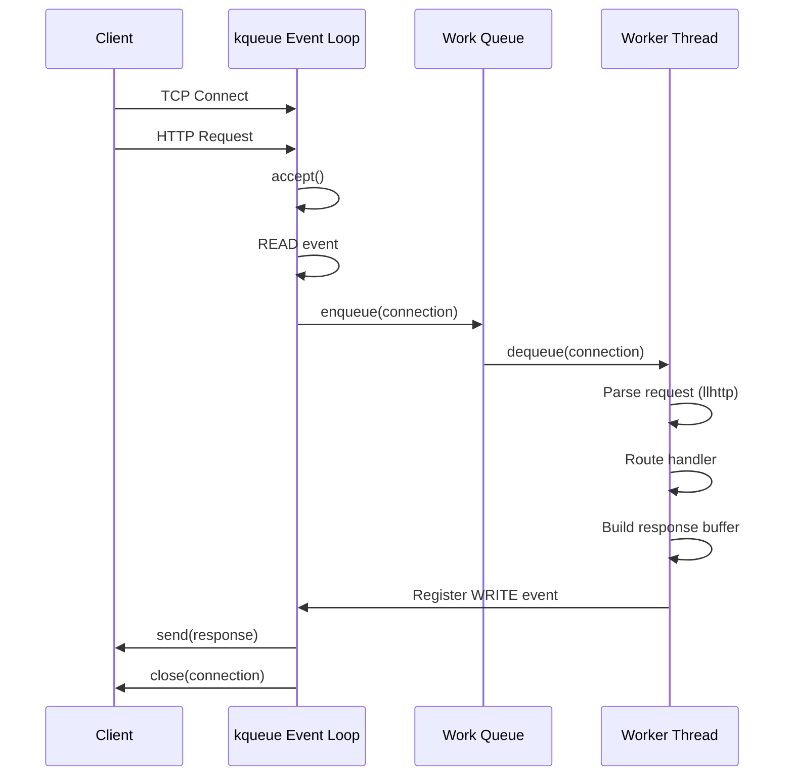

# ccybe

`ccybe` is a minimal HTTP/1.1 server written in raw C, built to expose the underlying system mechanics: sockets, event loops, and thread handling. It's a **learning project**, not a production framework.

**Networking:** raw POSIX sockets with manual HTTP/1.1 request parsing
**Concurrency:** kqueue-based event loop combined with a pthread worker pool
**Platform:** kqueue is a BSD/Darwin syscall, so this currently runs on **macOS and FreeBSD only** (no Linux support — that would need epoll)

---

## Features

* TCP server abstraction (`socket`, `bind`, `listen`, `accept`)
* Basic HTTP/1.1 request parsing (via `llhttp`)
* Simple routing system (hash table based)
* Event-loop–based client handling with a thread-pool–based request parser and response generator
* Static file serving

---

## Architecture



---

## Getting started

### Prerequisites

- macOS or FreeBSD (kqueue is not available on Linux)
- GCC
- Node.js (required to build llhttp from source)
- GNU Make

### 1. Clone with submodules

```bash
git clone --recurse-submodules https://github.com/labib0x9/ccybe.git
cd ccybe
```

If you already cloned without `--recurse-submodules`:

```bash
git submodule update --init --recursive
```

### 2. Build llhttp
llhttp generates its C source from a TypeScript definition, so Node.js is
required once at build time:

```bash
cd third_party/llhttp     # adjust path to wherever your submodule lives
npm install
make
cd ../..
```

klib is header-only — no build step needed.

### 3. Build and run

```bash
make run
```

The server starts on `:8080` by default. To serve static files, place them
under `./www/` directory.

---

## Usage

### 1. Create a TCP Listener

Create a TCP server bound to all interfaces on port `8080`. Internally, `s_listen()` wraps `socket()`, `bind()`, and `listen()`.

```c
listener_t ln = s_listen("tcp", ":8080");
if (ln.err != 0) {
    // handle error
}
```

---

### 2. Accept Client Connections

Accept incoming connections and abstract the file descriptor and address into a `client_t`.

```c
while (1) {
    client_t conn = s_accept(ln);
    // handle conn
}
```

---

### 3. Basic TCP Server Example

```c
#include "cnet.h"

void handle_conn(client_t client) {
    // handle client
    conn_close(client);
}

int main(void) {
    listener_t ln = s_listen("tcp", ":8080");
    if (ln.err != 0) {
        perror("listener failed");
        return 1;
    }

    while (1) {
        client_t conn = s_accept(ln);
        handle_conn(conn);
    }

    s_close(ln);
    return 0;
}
```

---

### 4. HTTP Parser Usage

Parse an HTTP/1.1 request using the built-in request context abstraction.

```c
#include "parser.h"

static const char CLOSE_CONN[] =
    "HTTP/1.1 200 OK\r\n"
    "Content-Length: 6\r\n"
    "Connection: close\r\n"
    "\r\n"
    "CLOSED";

int main(void) {
    request_ctx_t ctx;
    init_ctx(&ctx);

    int ok = parse_http_request(&ctx, CLOSE_CONN, strlen(CLOSE_CONN));
    if (ok == 1) {
        // bad request
    } else {
        // process request
    }

    printf("Path = %s\n", ctx.req.path);

    reset_ctx(&ctx);
    return 0;
}
```

---

### 5. Basic HTTP Server Example

```c
#include "http.h"

void default_page(response_ctx_t* wctx, request_ctx_t* rctx) {
    // handle root path
}

void api_front_page(response_ctx_t* wctx, request_ctx_t* rctx) {
    // handle /api
}

int main(void) {
    server_t server;
    init_server(&server);

    // default timeouts are 10 sec for both
    // set custom timeout
    server.recv_timeout = 60;
    server.send_timeout = 60;

    register_route(&server, "/", default_page);
    register_route(&server, "/api", api_front_page);

    serve_and_listen(&server, ":8080");
    return 0;
}
```

## Useful APIs

```c
int serve_and_listen(server_t* server, const char *address);
void init_server(server_t* server);
void register_route(server_t* server, const char* path, route_handler_fn func);
typedef void (*route_handler_fn)(response_ctx_t*, request_ctx_t*);

void set_header(response_ctx_t* ctx, const char* header, const char* value);
```

---

## Dependencies

* **llhttp** (git submodule) — HTTP request parsing
* **klib** (git submodule) — hash table implementation

---

## Current State

* Multiple client handling via an event loop and thread pool
* HTTP/1.1 request parsing (no chunked transfer encoding)
* Basic `GET` method support
* Routing via hash table lookup
* Static file serving

---

## Limitations

* Multiple header values are not fully supported
* No `Connection: keep-alive` handling. Connections are closed after every response.
* Static file serving, but connection is closed so same issue and has no path-traversal protection.
* Graceful shutdown is incomplete.

---

## Roadmap

Planned improvements for a more complete HTTP/1.1 server:

* Static file serving (default path is ./www/), if index.html is not present then directory listing.
* Structured logging
* Error handling
* Proper connection timeouts
* Proper signal handling and graceful termination

---

## Disclaimer

This project is intended for educational purposes. Expect breaking changes, rough edges, and incomplete features.
